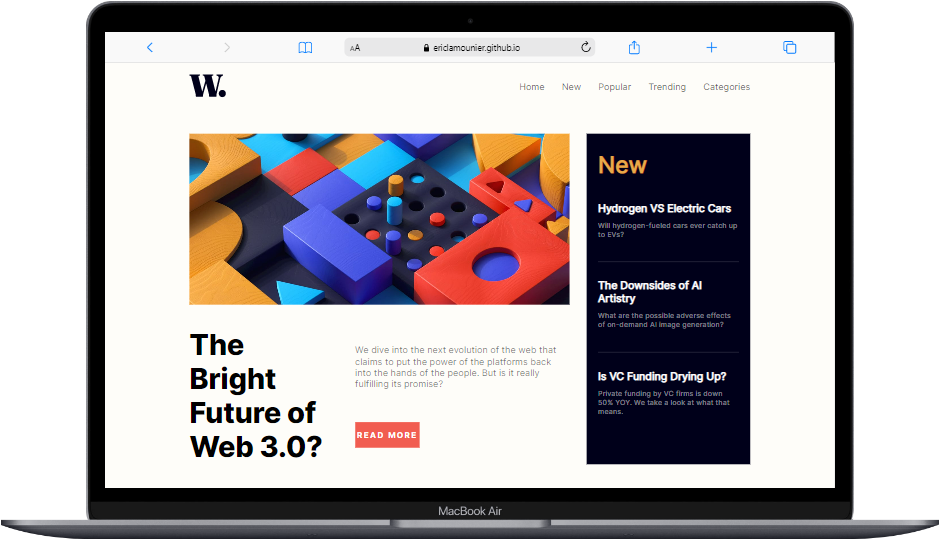
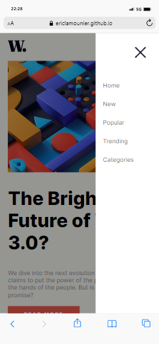

# Home Page W

    
    

Projeto construído utilizando os conceitos básicos de HTML5, CSS3 com fogo no flex-box.

[Clique aqui para acessar a página](https://ericlamounier.github.io/HomePageW/)

## Tecnologias

- HTML5
- CSS3

## Contato
eric.botelho@ufv.br

eric_lamounier@outlook.com